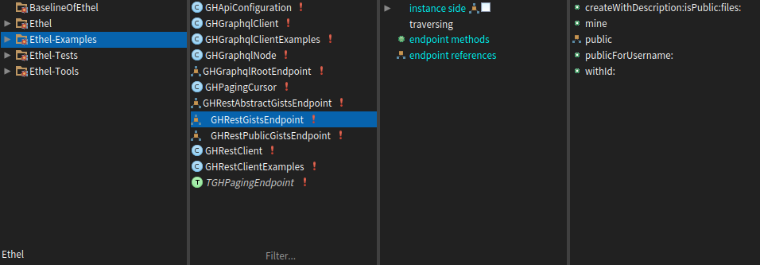

# Ethel


Lightweight framework for composing web service clients in Pharo Smalltalk. It encourages to reason about web services in terms of logical structures, promotes clean and easy to maintain architecture, and provides helpful introspective tools.

Ethel has a simple architecture that is able to support a wide range of APIs, including REST and GraphQL.  It can be used to write complete SDKs of varying complexity and comes with a simple DSL that allows one to quickly script interactions with REST and REST-like services.

## Documentation
* [Design](doc/design.md)
* [Scripting](doc/scripting.md)
* [Composing dedicated clients](doc/subclassing.md)
* [Introspection](doc/introspection.md)
* [Methodologies](doc/methodolgies.md)

## Getting started

Ethel is composed of a few packages, all of which are loaded by default. This is useful during development. However, in deployed environments you could benefit from not loading some of them, along with their dependencies.

* **Ethel** - Core classes
* **Ethel-Tests** - Test cases
* **Ethel-Tools** - Introspective tools, code browser and inspect extensions
* **Ethel-Examples** - Examples

### Installation

For Pharo 7 and up:

```smalltalk
Metacello new
  baseline: 'Ethel';
  repository: 'github://grype/Ethel';
  load.
```

In production environments, load the ‘core’ group, which includes only the core packages and excludes all tests, examples and tools:

```smalltalk
Metacello new
  baseline: 'Ethel';
  repository: 'github://grype/Ethel';
  load: #('core')
```

### Quick look

Let’s use GitHub’s gist API for a quick look into some of the capabilities offered by Ethel.

#### Scripting

```smalltalk
client := WSClient jsonWithUrl: 'https://api.github.com/' httpConfiguration: [ :http |
    http headerAt: 'Authorization' put: 'token <MyAuthToken>'
].


"GET /gists/public - First page of public gists"
endpoint := client / #gists / #public.
endpoint get.

"Enumerating gists using Collections-like API"
endpoint enumeration: [ :endpoint :limit :cursor |
    | result |
    "Return result of #get:, and update cursor"
		result := endpoint get: [ :http | 
			http 
				queryAt: #page put: (cursor at: #page ifAbsentPut: 1);
				queryAt: #page_size put: (cursor at: #page_size ifAbsentPut: 100)
			].
		cursor at: #page put: (cursor at: #page) + 1.
		cursor hasMore: result size = (cursor at: #page_size).
		result ].
endpoint collect: #yourself.
endpoint select: [:each | … ] max: 10.
endpoint detect: [:each | … ] ifFound: [ :gist | … ].


"POST /gists - Create a gist"
loadScript := 'Metacello new 
    baseline: ''Ethel''; 
    repository: ''github://grype/Ethel''; 
    load'.

files := { ‘example.st’ -> ({ #content -> loadScript } asDictionary) } asDictionary.
     
(client / #gists)
  post: [ :http |
    http request contents: {
      #description -> 'Loading Ethel’.
      #public -> true.
      #files -> files } asDictionary ]
```

#### Subclassing

When making a dedicated client, start by subclassing `WSClient` and then define endpoint classes that represent logical pieces of the API - like GitHub’s gists, for example. The framework allows both client and endpoint classes to configure HTTP request via `#configureOn:`.

```smalltalk
"Subclass WSClient"
WSClient subclass: #GHRestClient
    slots: { }
    classVariables: {  }
    package: ‘MyGithubApi’

"Configure http transport by adding a header"
WSClient>>#configureOn: http
    super configureOn: http.
    http headerAt: 'Authorization' put: 'token <MyAuthToken>'

"Define endpoint class for /gists"
Object subclass: #GHGistsEndpoint
    uses: TWSEndpoint
    slots: { }
    classVariables: { }
    package: ‘MyGithubApi’

"You must return a path relative to the client’s baseUrl via class side"
GHGistsEndpoint class>>#endpointPath
    ^ Path / #gists

"Public gists endpoint - this one deals with paginating results"
Object subclass: #GHPublicGistsEndpoint
    uses: TWSEndpoint + TWSEnumeration
    slots: { #page. #perPage }
    classVariables: { }
    package: ‘MyGithubApi’

GHPublicGistsEndpoint class>>#endpointPath
    ^ GHGistsEndpoint endpointPath / #public

"Instance should return a new cursor object to use for pagination"
GHPublicGistsEndpoint>>#cursor
    ^ WSPluggableCursor new. "Or your own cursor object"

"Fetch a single page of results using cursor"
GHPublicGistsEndpoint>>#next: limit with: cursor
    | result |
    page := cursor at: #page ifAbsentPut: [ 1 ].
    "Use limit value, if one is given, otherwise, use cursor's #perPage value"
    perPage := limit ifNil: [ cursor at: #perPage ifAbsentPut: 100 ].
    result := self execute.
    cursor at: #page put: page + 1.
    cursor hasMore: (result size = perPage).
    ^ result

"Configure request with pagination values"
GHPublicGistsEndpoint>>configureOn: http
    http 
        queryAt: #page put: page;
        queryAt: #per_page put: perPage

"Override trait's implementation of #execute, by adding <get> pragma"
GHPublicGistsEndpoint>>#execute
    <get>
    ^ wsClient execute: self

"Connect endpoints so that we can access them from the client and other endpoints"
WSClient>>#gists
    ^ self / GHGistsEndpoint

GHGistsEndpoint>>#public
    ^ self / GHPublicGistsEndpoint

```

That’s essentially the bare bones of a dedicated client for GitHub’s Gists. We defined two endpoints there - one for /gists and one for /gists/public. The former isn’t really needed for the latter to exist, and was added to provide an example of endpoint composition. You can look inside `Ethel-Examples` package for a functional implementation of these examples.

There are several benefits to subclassing `WSClient` and defining concrete endpoints. For one, the interaction with the client becomes more succinct:

```smalltalk
client := GHRestClient default.
client gists mine.
client gists public flatCollect: [:each | each at: #files] max: 10.
client gists 
  createWithDescription: 'GHRestClient' 
  isPublic: true 
  files: (GHRestClient methods collect: [ :each | (each selector asString , '.st') -> each asString ]) asDictionary.
```

And if you installed **Ethel-Tools** package, you'll find additional tools to help you develop and maintain your code.

#### Tools

**Browser**. Endpoint classes, methods that execute http requests and methods that reference other endpoints are distinguished in the class browser:



**Map**. When inspecting the client object, you get an overview of the API coverage and which parts of our implementation handle individual endpoints.


The map view, implemented as an extension to the inspector, distinguishes various types of implementations:
- gray nodes represent unimplemented path segments
- yellow nodes represent paths that are implemented by an endpoint but for which there are no executing methods (methods that actually generate an HTTP request)
- blue nodes represent concrete implementation - which means there's at least one executing method for that path
- filled blue nodes represent enumerating endpoints

**UML**. Inspecting clients, endpoints, or their classes, you also get UML visualization.


The UML view will show whatever is relevant to the inspected object. Inspecting the client object (or its class) gives the most extensive overview. Inspecting an endpoint object (or its class) limits the scope to classes that either reference or are referenced by the endpoint class. Gray lines here indicate a hierarchical relationship between classes. Blue and yellow arrows indicate references to/from other classes.

## Etymology

Ethel is named after Monty Python's Ethel the Aardvark, that is all...
