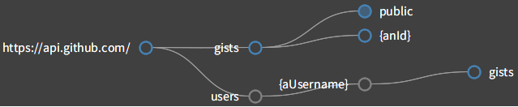
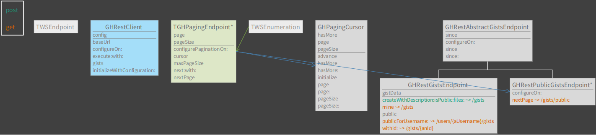

# Ethel

Lightweight framework for composing web service clients in Pharo Smalltalk. It encourages to reason about web services in terms of logical structures, promotes clean and easy to maintain architecture, and provides helpful introspective tools.

Ethel has a simple architecture that is able to support a wide range of APIs, including REST and GraphQL.  It can be used to write complete SDKs of varying complexity and comes with a simple DSL that allows one to quickly script interactions with REST and REST-like services.

## Documentation
* [Design](doc/design.md)
* [Scripting](doc/scripting.md)
* [Composing dedicated clients](doc/composing.md)
* [Introspection](doc/introspection.md)
* [Methodologies](doc/methodolgies.md)

## Getting started

Ethel is composed of a few packages, all of which are loaded by default. This is useful during development. However, in deployed environments you could benefit from not loading some of them, along with their dependencies.

* **Ethel** - Core classes
* **Ethel-Tests** - Test cases
* **Ethel-Tools** - Introspective tools, code browser and inspect extensions
* **Ethel-Examples** - Examples

### Installation

For Pharo 7 and up:

```smalltalk
Metacello new
  baseline: 'Ethel';
  repository: 'github://grype/Ethel';
  load.
```

In production environments, load the ‘core’ group, which includes only the core packages and excludes all tests, examples and tools:

```smalltalk
Metacello new
  baseline: 'Ethel';
  repository: 'github://grype/Ethel';
  load: #('core')
```

### Quick look

Let’s use GitHub’s gist API for a quick look into some of the capabilities offered by Ethel.

#### Scripting

```smalltalk
client := WSClient jsonWithUrl: 'https://api.github.com/'.
client httpConfiguration: [ :http |
    http headerAt: 'Authorization' put: 'token <MyAuthToken>'
].


"GET /gists/public - First page of public gists"
(client / #gists / #public) get.

"Enumerating gists using Collections-like API"
client enumerationBlock: [ :endpoint :limit :cursor |
    | result |
    endpoint dataAddAll: {
        #page -> ( cursor data at: #page ifAbsentPut: 1 ).
        #per_page -> ( limit ifNil: [ 200 ] ) } asDictionary.
    result := endpoint get.
    cursor data at: #page put: (cursor data at: #page) + 1.
    cursor hasMore: (result size < (endpoint data at: #per_page) ).
    result ].
(client / #gists / #public) collect: #yourself.
(client / #gists / #public) select: [:each | … ] max: 10.
(client / #gists / #public) detect: [:each | … ] ifFound: [ :gist | … ].


"POST /gists - Create a gist"
loadScript := 'Metacello new 
    baseline: ''Ethel''; 
    repository: ''github://grype/Ethel''; 
    load'.

files := { ‘example.st’ -> ({ #content -> loadScript } asDictionary) } asDictionary.
     
(client / #gists) 
     dataAddAll: {
        #description -> 'Loading Ethel’.
        #public -> true.
        #files -> files } asDictionary;
     post.
```

#### Composing a dedicated client

When making a dedicated client, start by subclassing `WSClient` and then define endpoint classes that represent logical pieces of the API - like GitHub’s gists, for example. The framework allows both client and endpoint classes to configure HTTP request via `#configureOn:`.

```smalltalk
"Subclass WSClient"
WSClient subclass: #GHRestClient
    slots: { }
    classVariables: {  }
    package: ‘MyGithubApi’

"Configure http transport by adding a header"
WSClient>>#configureOn: http
    super configureOn: http.
    http headerAt: 'Authorization' put: 'token <MyAuthToken>'

"Define endpoint class for /gists"
Object subclass: #GHGistsEndpoint
    uses: TWSEndpoint
    slots: { }
    classVariables: { }
    package: ‘MyGithubApi’

"You must return a path relative to the client’s baseUrl via class side"
GHGistsEndpoint class>>#endpointPath
    ^ Path / #gists

"Public gists endpoint - this one deals with paginating results"
Object subclass: #GHPublicGistsEndpoint
    uses: TWSEndpoint + TWSEnumeration
    slots: { #page. #perPage }
    classVariables: { }
    package: ‘MyGithubApi’

GHPublicGistsEndpoint class>>#endpointPath
    ^ GHGistsEndpoint endpointPath / #public

GHPublicGistsEndpoint>>cursor:
    ^ WSPluggableCursor new. "Or your own cursor object"

GHPublicGistsEndpoint>>next: limit with: cursor
    | result |
    page := cursor data at: #page ifAbsentPut: [ 1 ].
    perPage := next ifNil: [ cursor data at: #perPage ifAbsentPut: [ 100 ] ].
    result := self nextPage.
    (result isNotNil and: [ result size >= perPage ])
        ifTrue: [ cursor data at: #page put: page + 1 ]
        ifFalse: [ cursor hasMore: false ].
    ^ result

GHPublicGistsEndpoint>>configureOn: http
    http 
        queryAt: #page put: page;
        queryAt: #per_page put: perPage

GHPublicGistsEndpoint>>nextPage
    <get>
    ^ self execute

"Connect endpoints so that we can access them from the client and other endpoints"
WSClient>>#gists
    ^ self / GHGistsEndpoint

GHGistsEndpoint>>#public
    ^ self / GHPublicGistsEndpoint

```

That’s essentially the bare bones of a client for GitHub’s Gists. We defined two endpoints there - one for /gists and one for /gists/public. The former isn’t really needed for the latter to exist, and was added to provide an example of endpoint composition. You can look inside `Ethel-Examples` package for a functional implementation of these examples.

There are several benefits to subclassing `WSClient` and defining concrete endpoints. For one, the interaction with the client becomes more succinct:

```smalltalk
client := GHRestClient default.
client gists mine.
client gists public flatCollect: [:each | each at: #files] max: 10.
client gists 
  createWithDescription: 'GHRestClient' 
  isPublic: true 
  files: (GHRestClient methods collect: [ :each | (each selector asString , '.st') -> each asString ]) asDictionary.
```

When inspecting the client object, you get an overview of the API coverage and which parts of our implementation handle individual endpoints:



You also get UML diagrams for both client and endpoint object, which show both hierarchical and dependency relationships, and look something like this:



## Etymology

Ethel is named after Monty Python's Ethel the Aardvark, that is all...
