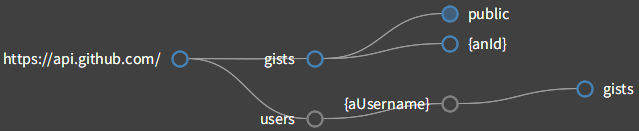

# Introspection

Ethel provides a few introspection tools to help you grok implementation of a client and associated endpoints. A lot of the information derived by these tools is derived from the source code. That's why it's a good idea to reference your endpoints from the client and other endpoints, as well as to mark your **executing methods** with the HTTP method pragma.

The code for the following examples can be found in **Ethel-Examples** package, and is based on GitHub's Gists API.

## The Map

The map provides a visual overview of the API coverage. For REST APIs, this is typically going to be a map of paths, starting from the client's base URL. To see what that looks like:

```smalltalk
GHRestClient default inspect.
```

You should see an inspector window for the instance of `GHRestClient`. Under the "Map" tab you should see this:



The root node reflects the client's base URL. All of the descendent nodes represent endpoints:
* the blue node indicate that there are **executing methods** for the path
* the filled blue nodes indicate that there's an enumerating endpoint for that path
* the gray node indicates paths for which there are no endpoints defined and for which there are no **executing methods** - i.e. no implementation
* the yellow node (not depicted) indicates that there's an endpoint class for the given endpoint path, but there aren't any **executing methods** for it

Hovering over a node would reveal, in a popover, relevant information about the node - i.e. an endpoint class for the path, or list of **executing methods**. Selecting a node would inspect implementors of the corresponding path.

## UML

Inspecting clients, endpoints, and their classes, would reveal an extra tab, titled "UML", that shows UML diagram of the inspected object. Inspecting the client, or its class, gives the most extensive overview, since that includes the client and all the endpoints. On the other hand, inspecting an endpoint, or its class, would limit UML visualization to the inspected object and all the relevant objects that it references, or is referenced by. Let's see what that looks like...


The legend, shown in the top left corner, lists all of the HTTP methods utilized by the **executing methods**. The client object is distinguished with the blue background; endpoints - in white; and traits in the olive green color. Base classes and traits, if shown, will not list any methods. Class boxes follow the UML standard, with the **executing methods** showing their effective path, and color coded according to their HTTP method. Hovering over a class box reveals connections to other classes that are either referenced by the target class (blue arrows), or reference the target  class (yellow arrows). The white lines indicate class inheritance. All of the objects are draggable...